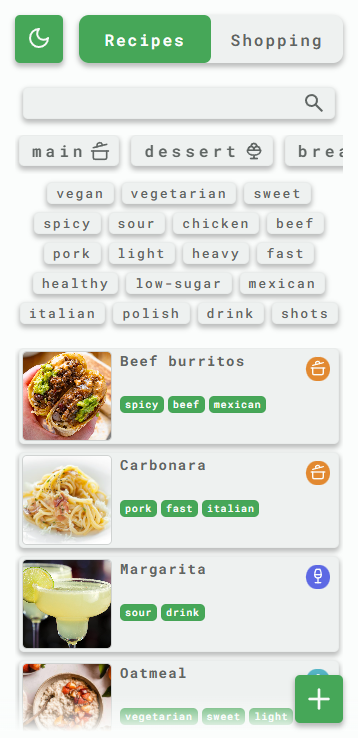
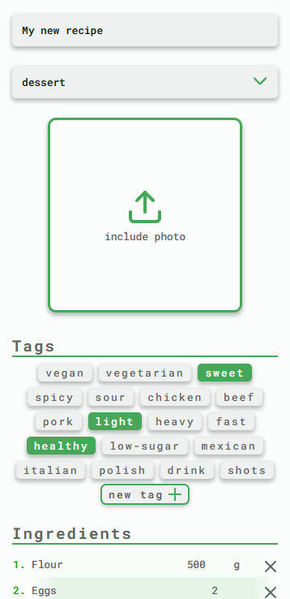
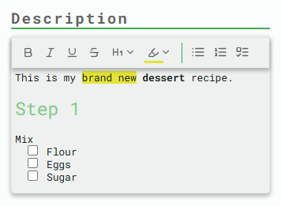
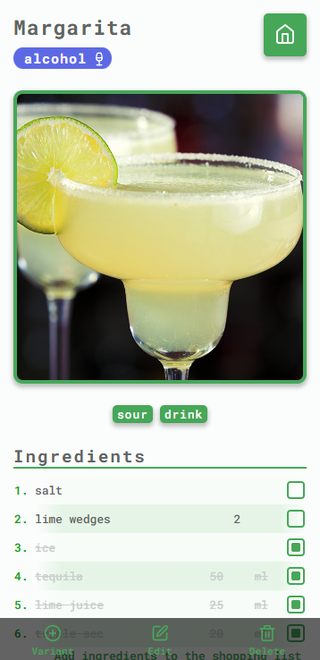
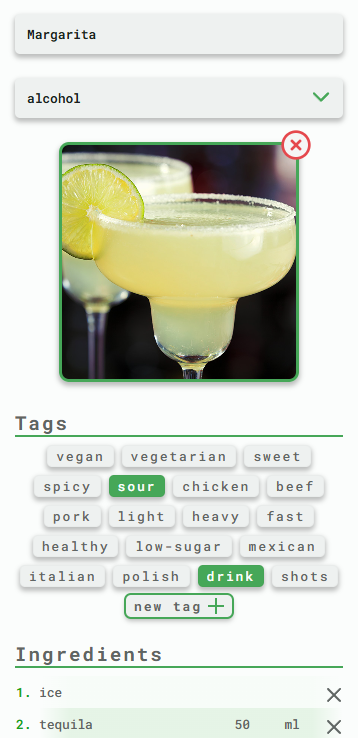
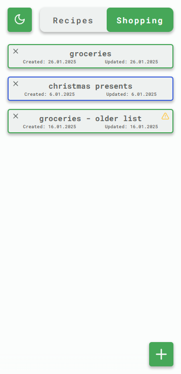
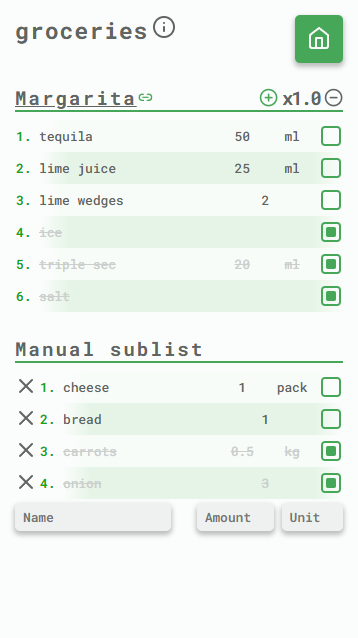
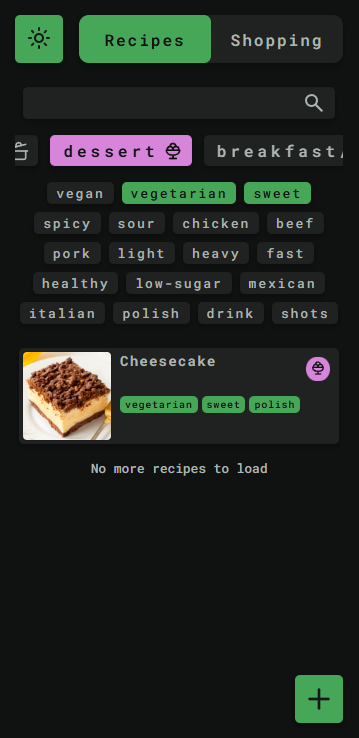

# Personal Cookbook

A private, modern-looking and intuitive web application designed to help you manage your recipes and access them whenever you need.

The application's main focus are the recipes, but it also provides a very helpful "Shopping" page, where you can keep track of your groceries.

## Features

Here is the list of all the features that are part of the current version. You can also check them out in the [interactive demo](https://tgrochowski87.github.io/cookbook/#/recipes). All the data there is stored in memory so feel free to play around with it and it will be right back to the initial state when you refresh the page.

<table style="margin: auto">
<tr style="margin: auto">
  <td>
  
  </td>
  <td>
  
The first page of the application shows the list of all the recipes split into pages in a form of infinite scroll.

  
Above the list is a search section, which allows filtering recipes by name, category and tags.

  </td>
  </tr>
</table>

<table style="margin: auto">
<tr style="margin: auto">
  <td>
  
Clicking on the '+' button redirects the user to the recipe creation form.

  
The user is not forced to finish it in one go. All recipes can be later edited. Additionally, if the form is closed without saving, the entered data can be restored the next time it is opened.

  </td>
  <td>
  
  </td>
  </tr>
</table>

<table style="margin: auto">
<tr style="margin: auto">
  <td>
  
  </td>
  <td>
  
The recipe description supports various text decorations, thanks to the rich text editor that renders enered text in the adequate HTML tags with styling.

  </td>
  </tr>
</table>

<table style="margin: auto">
<tr style="margin: auto">
  <td>
  
Clicking on any recipe redirects the user to the recipe view page.

  
The state of any checkboxes visible on this page, including the ones in the recipe description, if there are any, is preserved in session to not lose track on the preparation progress.

  
From this view, the user can also add all the ingredients to the selected shopping list.

  </td>
  <td>
  
  </td>
  </tr>
</table>

<table style="margin: auto">
<tr style="margin: auto">
  <td>
  
  </td>
  <td>
  
From the view page, the user can open the editing form by clicking on the 'Edit' button at the bottom of the page.

  
The pending changes in this form get preserved the same way as in the one for creation.

  </td>
  </tr>
</table>

<table style="margin: auto">
<tr style="margin: auto">
  <td>
  
With this big switch on top of the page, the user can switch between the recipes and the shopping lists.

  
By default, shopping lists get automatically deleted after two weeks. This, combined with the shopping list creation being done with a single click (with the name being the current date), allows quick preparation of a list for groceries for the near future shopping, without the need for further management.

  
When the list is within a week from the automatic deletion date, a yellow warning icon is displayed on the right.

  
The lists with blue border are the ones that were opted out of the automatic deletion.

  </td>
  <td>
  
  </td>
  </tr>
</table>

<table style="margin: auto">
<tr style="margin: auto">
  <td>
  
  </td>
  <td>
  
Clicking on any shopping list opens the view with its details.

  
There is no option to add items to the list of ingredients copied from recipes, but besides that, the list can be edited freely and all changes get saved automatically on closing the view or the application.

  </td>
  </tr>
</table>

<table style="margin: auto">
<tr style="margin: auto">
  <td>
  
The application also supports dark mode, with the initial choice being based on the browser settings.

  </td>
  <td>
  
  </td>
  </tr>
</table>

## Technology Stack

## Remarks
